# Visual Diagrams for Medium Article

This document contains Mermaid diagrams that visualize the RAG strategies explained in [MEDIUM_ARTICLE.md](MEDIUM_ARTICLE.md). These diagrams render automatically on GitHub.

---

## Table of Contents

1. [System Architecture](#system-architecture)
2. [Re-ranking Strategy](#re-ranking-strategy)
3. [Multi-Query RAG](#multi-query-rag)
4. [Self-Reflective RAG](#self-reflective-rag)
5. [Agentic RAG](#agentic-rag)
6. [Ingestion Pipeline](#ingestion-pipeline)
7. [Strategy Decision Tree](#strategy-decision-tree)

---

## System Architecture

**Description:** This diagram shows the complete RAG system architecture, from document input through processing, retrieval strategies, and final generation. Color coding: Blue (input/processing), Green (retrieval), Purple (strategy selection), Orange (generation).

---

## Re-ranking Strategy

```mermaid
graph TD
    A[User Query:<br/>'What is LoRA-SHIFT?'] --> B[Stage 1: Fast Vector Search]
    B --> C[Retrieve 20-50 Candidates<br/>Initial Results]
    
    C --> D{Stage 2:<br/>Cross-Encoder<br/>Re-ranking}
    
    D --> E[Chunk 7: 0.94 ⭐]
    D --> F[Chunk 1: 0.89 ⭐]
    D --> G[Chunk 15: 0.87 ⭐]
    D --> H[Chunk 3: 0.85 ⭐]
    D --> I[Chunk 12: 0.82 ⭐]
    
    E --> J[Top 5 Results<br/>High Precision]
    F --> J
    G --> J
    H --> J
    I --> J
    
    J --> K[Return to LLM<br/>for Generation]
    
    style A fill:#3B82F6,stroke:#2563EB,color:#fff
    style B fill:#10B981,stroke:#059669,color:#fff
    style C fill:#10B981,stroke:#059669,color:#fff
    style D fill:#8B5CF6,stroke:#7C3AED,color:#fff
    style E fill:#F59E0B,stroke:#D97706,color:#fff
    style F fill:#F59E0B,stroke:#D97706,color:#fff
    style G fill:#F59E0B,stroke:#D97706,color:#fff
    style H fill:#F59E0B,stroke:#D97706,color:#fff
    style I fill:#F59E0B,stroke:#D97706,color:#fff
    style J fill:#F59E0B,stroke:#D97706,color:#fff
    style K fill:#10B981,stroke:#059669,color:#fff
```

**Description:** The re-ranking strategy uses a two-stage approach. Stage 1 performs fast vector search to retrieve 20-50 candidates. Stage 2 uses a slower but more accurate cross-encoder to re-rank these candidates and return the top 5 highest quality results. This balances speed and precision.

**Performance:** ~15-30% better precision than vector search alone, with 100-200ms additional latency.

---

## Multi-Query RAG

**Description:** Multi-Query RAG generates multiple query variations to capture different perspectives. All queries are searched in parallel, and results are deduplicated with the highest similarity score kept for each unique chunk.

**Performance:** ~20-35% better recall, with 4x database queries (parallelized).

---

## Self-Reflective RAG

**Description:** Self-Reflective RAG evaluates the quality of retrieved results and iteratively refines the query if needed. The LLM grades relevance on a 1-5 scale. If the score is low (<3), the query is refined and the search is repeated.

**Performance:** Highest quality results, but 2-3x latency due to multiple LLM calls.

---

## Agentic RAG

**Description:** Agentic RAG gives the agent multiple tools and lets it autonomously decide which to use based on the query. Tools can include vector search, full document retrieval, SQL queries, and web search. The agent can combine multiple tools for comprehensive answers.

**Example:** Query "What's the full refund policy?" → Agent uses vector search to find relevant chunks, then retrieves the full policy document.

---

## Ingestion Pipeline

```mermaid
graph LR
    A[📁 Documents<br/>PDF, DOCX, MD, MP3] --> B[📝 Detection &<br/>Format Analysis]
    
    B --> C{Document Type}
    
    C -->|PDF| D[Docling:<br/>Layout + OCR]
    C -->|Office| E[Docling:<br/>Structure Parser]
    C -->|Markdown| F[Direct<br/>Processing]
    C -->|Audio| G[Whisper:<br/>Transcription]
    
    D --> H[🔄 Convert to<br/>Markdown]
    E --> H
    F --> H
    G --> H
    
    H --> I[✂️ Chunking<br/>Docling HybridChunker]
    
    I --> J{Optional:<br/>Contextual<br/>Enrichment?}
    
    J -->|Yes| K[🤖 LLM adds<br/>Context Prefix]
    J -->|No| L[📊 Generate<br/>Embeddings]
    
    K --> L
    
    L --> M[💾 Store in<br/>PostgreSQL]
    
    M --> N[🗄️ Documents Table]
    M --> O[🗄️ Chunks Table<br/>with Vectors]
    
    style A fill:#3B82F6,stroke:#2563EB,color:#fff
    style B fill:#10B981,stroke:#059669,color:#fff
    style D fill:#10B981,stroke:#059669,color:#fff
    style E fill:#10B981,stroke:#059669,color:#fff
    style F fill:#10B981,stroke:#059669,color:#fff
    style G fill:#10B981,stroke:#059669,color:#fff
    style H fill:#10B981,stroke:#059669,color:#fff
    style I fill:#8B5CF6,stroke:#7C3AED,color:#fff
    style J fill:#8B5CF6,stroke:#7C3AED,color:#fff
    style K fill:#F59E0B,stroke:#D97706,color:#fff
    style L fill:#F59E0B,stroke:#D97706,color:#fff
    style M fill:#10B981,stroke:#059669,color:#fff
    style N fill:#10B981,stroke:#059669,color:#fff
    style O fill:#10B981,stroke:#059669,color:#fff
```

**Description:** The ingestion pipeline processes documents through multiple stages: format detection, conversion to unified Markdown, intelligent chunking with Docling, optional contextual enrichment, embedding generation, and storage in PostgreSQL with pgvector.

**Key Features:**
- Multi-format support (PDF, Office, Markdown, Audio)
- Semantic chunking preserves document structure
- Optional LLM-based context enrichment
- Efficient parallel processing

---

## Strategy Decision Tree

```mermaid
graph TD
    A[What's your<br/>primary goal?] --> B{Choose One}
    
    B -->|SPEED| C[⚡ Speed Priority<br/>< 500ms latency]
    B -->|PRECISION| D[🎯 Precision Priority<br/>High accuracy]
    B -->|RECALL| E[📚 Recall Priority<br/>Comprehensive results]
    B -->|FLEXIBILITY| F[🔀 Flexibility Priority<br/>Diverse queries]
    B -->|DOMAIN| G[🏢 Domain-Specific<br/>Specialized field]
    
    C --> C1[✅ Standard Vector Search<br/>+ Context-Aware Chunking<br/>+ Embedding Cache]
    C1 --> C2[Budget: $ Low]
    
    D --> D1[✅ Re-ranking<br/>+ Contextual Retrieval*<br/>+ Hybrid Retrieval**]
    D1 --> D2[Budget: $$$ High<br/>*if critical docs<br/>**if specific terms]
    
    E --> E1[✅ Multi-Query RAG<br/>+ Query Expansion<br/>+ Larger top-k 10-20]
    E1 --> E2[Budget: $$ Medium]
    
    F --> F1[✅ Agentic RAG<br/>+ Multiple Tools<br/>+ Self-Reflective*]
    F1 --> F2[Budget: $$ Medium<br/>*for research queries]
    
    G --> G1[✅ Fine-tuned Embeddings<br/>+ Knowledge Graphs*<br/>+ Fact Verification**]
    G1 --> G2[Budget: $$$ High<br/>*if relationships matter<br/>**if high-stakes]
    
    style A fill:#3B82F6,stroke:#2563EB,color:#fff
    style B fill:#8B5CF6,stroke:#7C3AED,color:#fff
    style C fill:#10B981,stroke:#059669,color:#fff
    style D fill:#F59E0B,stroke:#D97706,color:#fff
    style E fill:#10B981,stroke:#059669,color:#fff
    style F fill:#8B5CF6,stroke:#7C3AED,color:#fff
    style G fill:#F59E0B,stroke:#D97706,color:#fff
    style C1 fill:#10B981,stroke:#059669,color:#fff
    style D1 fill:#F59E0B,stroke:#D97706,color:#fff
    style E1 fill:#10B981,stroke:#059669,color:#fff
    style F1 fill:#8B5CF6,stroke:#7C3AED,color:#fff
    style G1 fill:#F59E0B,stroke:#D97706,color:#fff
```

**Description:** This decision tree helps you choose the right RAG strategy based on your primary goal. Consider your requirements for speed, accuracy, coverage, flexibility, and domain specificity, along with your budget constraints.

**Budget Guide:**
- **$ (Low):** Basic vector search, caching, context-aware chunking
- **$$ (Medium):** Add query enhancement, re-ranking, multi-query
- **$$$ (High):** Include contextual retrieval, fine-tuning, verification

---

## Usage Notes

These diagrams are rendered using Mermaid, which is natively supported by GitHub. To use them:

1. **On GitHub:** Diagrams render automatically when viewing this file
2. **In VS Code:** Install the "Markdown Preview Mermaid Support" extension
3. **In other editors:** Use Mermaid Live Editor (https://mermaid.live/) to preview
4. **Export as images:** Use Mermaid CLI or online tools to generate PNG/SVG

## Creating Custom Diagrams

To create additional diagrams or modify these:

1. Visit https://mermaid.live/
2. Copy the mermaid code block
3. Edit and preview in real-time
4. Export as PNG or SVG if needed

## Color Scheme

- **Blue (#3B82F6):** Input/User interactions
- **Green (#10B981):** Retrieval/Search operations
- **Purple (#8B5CF6):** Decision points/Strategy selection
- **Orange (#F59E0B):** Generation/LLM operations
- **Red (#EF4444):** Warnings/Errors (when needed)

---

*For more details on each strategy, see [MEDIUM_ARTICLE.md](MEDIUM_ARTICLE.md)*
