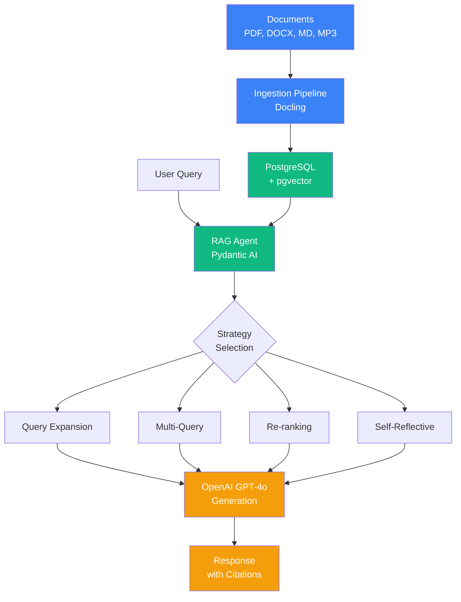
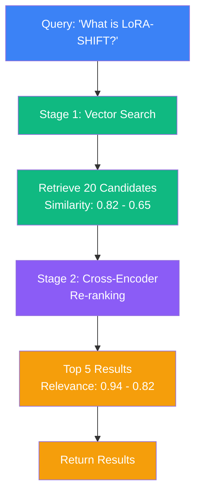

# Visual Assets for Medium Article

This directory contains visual diagrams and screenshots referenced in the Medium article (`MEDIUM_ARTICLE.md`).

## Required Diagrams

The following diagrams should be created to accompany the article:

### 1. system-architecture.png
**Description:** Complete system architecture showing the data flow
- Documents input → Ingestion Pipeline → PostgreSQL + pgvector
- User Query → RAG Agent → Strategy Selection → OpenAI GPT-4o → Response
- Include component icons and arrows showing data flow
- Color-code stages: Blue (ingestion), Green (retrieval), Orange (generation)

**Tools to create:** Draw.io, Lucidchart, Excalidraw, or Mermaid diagrams

### 2. reranking-diagram.png
**Description:** Two-stage retrieval process
- Stage 1: Wide funnel showing 20 candidates with similarity scores
- Arrow to Stage 2: Narrow funnel with cross-encoder re-ranking
- Output: Top 5 results with relevance scores
- Use different colors for each stage

### 3. query-expansion-diagram.png
**Description:** Query expansion process flow
- Original short query at top
- LLM expansion step in middle (with system prompt)
- Expanded detailed query at bottom
- Arrows showing transformation

### 4. multi-query-diagram.png
**Description:** Parallel multi-query execution
- Single query at top splitting into 4 variations
- 4 parallel search arrows (show concurrency)
- Results from each query converging
- Deduplication step
- Final merged results

### 5. contextual-retrieval-diagram.png
**Description:** Before/After comparison
- Side-by-side layout
- Left: Plain chunk without context
- Middle: Arrow with "LLM adds context" label
- Right: Enriched chunk with contextual prefix highlighted

### 6. context-aware-chunking-diagram.png
**Description:** Comparison of chunking strategies
- Top: Document structure tree (headings, sections)
- Middle: Naive chunking (broken, mid-sentence splits) - marked with ❌
- Bottom: Semantic chunking (clean boundaries, preserved context) - marked with ✅

### 7. self-reflective-diagram.png
**Description:** Iterative self-reflection loop
- Circular/spiral flow diagram
- Steps: Initial Search → Grade → Decision Diamond
- If low grade: Refine Query → Re-search (loop back)
- If high grade: Return Results (exit)

### 8. agentic-rag-diagram.png
**Description:** Agent with multiple tools
- Central "Agent" node
- Connected tool nodes: Search, SQL, Web, Documents
- Example query showing tool selection process

### 9. ingestion-pipeline-diagram.png
**Description:** Horizontal pipeline flow
- Steps: Detection → Conversion → Chunking → Enrichment → Embedding → Storage
- Show example transformations at each step

### 10. decision-tree-diagram.png
**Description:** Strategy selection flowchart
- Start node: "What's your goal?"
- Branch nodes: Speed, Precision, Recall, Flexibility, Domain-Specific
- Leaf nodes: Recommended strategies
- Include cost indicators ($, $$, $$$)

## Required Screenshots

### 1. streamlit-interface.png
**Description:** Streamlit Strategy Lab interface
- Side-by-side strategy comparison
- Query input at top
- Results showing chunks, scores, metrics
- Performance comparison

**To capture:**
1. Run `streamlit run app.py` in implementation directory
2. Select 3 different strategies
3. Enter a query like "What is LoRA-SHIFT?"
4. Take full-window screenshot

### 2. setup-success.png
**Description:** Terminal showing successful setup
- Ingestion process output
- Document processing messages
- Chunk creation stats
- Success messages

**To capture:**
1. Run `python -m ingestion.ingest --documents ./documents`
2. Capture terminal output

## Creating the Diagrams

### Recommended Tools

1. **Draw.io / Diagrams.net** (Free, web-based)
   - https://app.diagrams.net/

2. **Excalidraw** (Free, simple sketching)
   - https://excalidraw.com/

3. **Mermaid** (Code-based diagrams)
   - Can be rendered in Markdown
   - GitHub supports Mermaid natively

### Style Guidelines

- **Colors:**
  - Blue (#3B82F6): Ingestion/Input
  - Green (#10B981): Retrieval/Search
  - Orange (#F59E0B): Generation/LLM
  - Purple (#8B5CF6): Strategy-specific features
  - Gray (#6B7280): Infrastructure/Database

- **Fonts:**
  - Sans-serif (Arial, Helvetica, Inter)
  - Minimum 12pt for readability

- **Resolution:**
  - Minimum 1200px wide
  - Export as PNG

## Example Mermaid Diagrams

### System Architecture

### Re-ranking Flow

## Notes

- All diagrams should be placed in this `docs/assets/` directory
- Reference images in the article using relative paths
- Keep file sizes reasonable (< 500KB per image)
- Use descriptive filenames

## Contributing

If you create these diagrams, please:
1. Follow the style guidelines above
2. Export at high resolution
3. Include source files if possible (.drawio, .excalidraw)
4. Update this README with any additional notes
